# PFSAK (Programmers File Swiss Army Knife)
PFSAK is a project that includes many necessary tools that an engineer can use and provides the simplest use.

## How to use PFSAK app?
  - [Initial execution](#Initial-execution)
  - [Copy processors between profiles](#Copy-processors-between-profiles)
  - [Change current password](#Change-current-password)
  - [Run profile](#Run-profile)
  - [Keyboard shortcuts](#Keyboard-shortcuts)

## Initial execution
If you are opening the application for the first time, you will be faced with the "Create password" window. If you wish, set a password, and save it somewhere to remember Pay attention to the upper-case and lower-case special characters in the password you have specified. If you forget the password, you will need to remove the "pfsak.configs" file from the computer. This means that the information you have saved in the program will be lost.

After successfully passing the above stage, you will see the profile named "Default Profile" determined by us. You can add what you want to do by pressing the "+" button. You can see all the operations you can do from the picture on the right. These expressions will be added to the list at the top left as you add. When you list in the upper left part, you will see the opposite of this order in the list at the top right.  

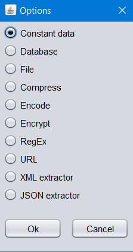

The processors you add will be the inverse. e.g. For “CompressConfig” processor, if "Compress" is marked in the list on the left, "Decompress" will be marked in the list on the right.

**The system does not automatically generate inverse processing for RegEx, XML, JSON and URL.**

## Copy processors between profiles
You can copy your data between profiles in the system. By click to Profiles -> Copy… section, the window which is at the right side will open. This window is where you place the copy process. The section that is indicated by red arrow points out the profile you want to copy, and the section that is indicated by blue arrow points out where you copy. That panel shows the information of profile that is selected by red. This is enough for copying a profile. If you want to copy more than an processor in profile, you can select processors holding down CTRL key without any space between them.

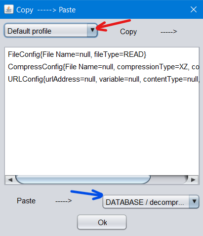

## Change current password
If you want to change the current password. The path you have to follow is that: Password -> Change… Here, you must first verify your old password. As soon as this process is completed successfully, the screen where you can change your password will appear. In order for the password change to take place, the passwords you wrote in both TextFields must match each other, otherwise you cannot click the "Ok" button.

## Run profile
When you click the "Run >>" button after making all the necessary additions, the application will run, and it will give you the necessary outputs. The "Inverse <<" button represents the opposite of the operations performed under the "Run >>" button. You can check whether the program is running or not from the "Print -->" section below. If there is no printout in this part, the system has not worked properly and will not give output to you.

## Keyboard shortcuts
|  Action   |  Shortcut  |
|:-------:| :-----:|
| Create new profile  | **CTRL + N**      |
| Delete profile   | **CTRL + D**    |
| If you want to copy the processors from the profile to another profile     | **CTRL + C**   |
| Rename profile    | **F2**  |
| Save    | **CTRL + S**  |
| Exit    | **ALT + F4**  |
| Add a new processor to profile    | **+**  |
| Delete existing processor in profile    | **-**  |

## Processors
You have to double click on the processor on which you want to act from the listing on the left or right.

### Compress Processor
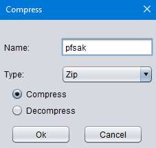
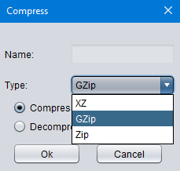

The compress processor can perform 3 different compress operations. These are XZ, GZip and Zip as seen in the picture. You do not need to give name while performing XZ and Gzip operations. However, you must nominate the file while performing the Zip process.

### Constant Processor
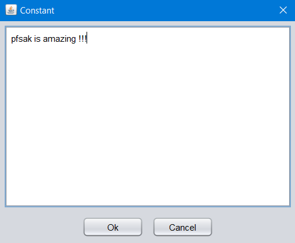

In the constant processor section, it allows you to directly write the data you want to process without having to read any files.

### Database Processor
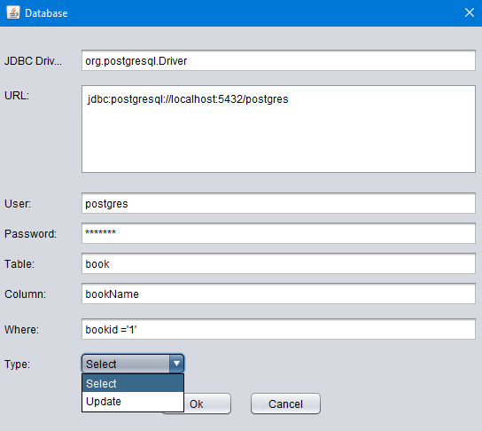

At the database processor section, it allows you to “Select” and “Update” from whichever type you want. You are required to enter the extension you are using into the JDBC Driver section. In the picture you can see the example of PostgreSQL! The url section should be the url of your own database. After filling the sections about which column of which table, which kind of information you want to drag, your process is done. 

### Encode Processor
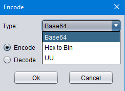

There are 3 encoding processes in the Encode processor part, these are "BASE64", "Hex to Bin" and "Uuencode". It will be enough to select the operation you want to do and click the Encode or Decode buttons.

### Encryption Processor
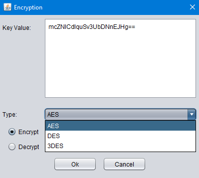

Encryption Processor section allows you to encrypt or decrypt your data. You have to enter the key you want to encrypt yourself.
You must enter the correct length key:
|  Encryption TYPE   | BYTE LENGTH | EXAMPLE KEY  |
|:-------:| :-----:| :-----:|
| AES key value |  16 byte |  8kN+1HCWTusn76X0dIDoqA== | 
| DES key value | 8 byte | aoeG4Rz00R8= | 
| 3DES key value | 24 byte | 0qRNUAK7jgGdbxVWa8PjY55N6jDZKAjG | 

### File Processor
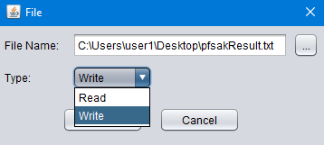

You can perform reading and writing operations in File Processor section. Make sure that you have written the correct target file or you can directly select the file by clicking the "…" section on the right.

### JSon Extractor Processor 
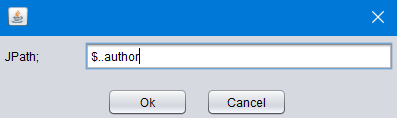

JSon Extractor Processor allows you to eliminate information from your data about Json. You can see the example in the picture. If you have a Json data exists  authors and their books, you can get "All authors" with the sample command in the picture.

### RegEx Processor (Regular Expression Processor)
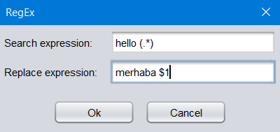

RegEx Processor searches for the words you specified in your file and replaces them with the word you want.,

### URL Processor

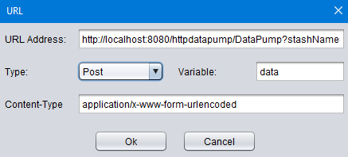

You can “Get”, “Post” and “Put” your data in URL Processor. Unlike other Types, you do not need to fill your "Content-Type" part in Get type.

### XML extractor Processor
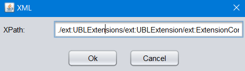

The XML extractor Processor allows you to extract (eliminate) the necessary information from the XML file extension. Be sure you've entered the correct Xpath.
