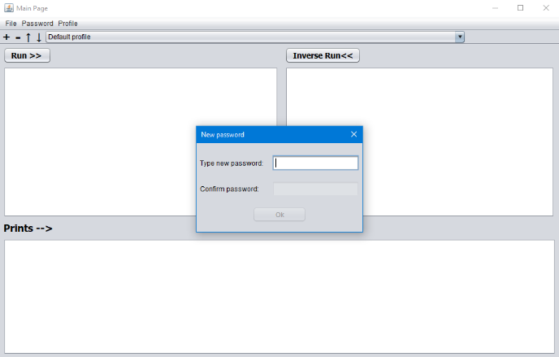
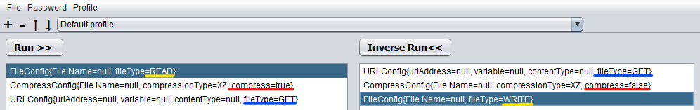

# PFSAK (Programmers File Swiss Army Knife)
PFSAK is a project that includes many necessary tools that an engineer can use and provides the simplest use.

## How to use PFSAK app?
  - [Initial execution](#Initial-execution)
  - [Copy processors between profiles](#Copy-processors-between-profiles)
  - [Change current password](#Change-current-password)
  - [Run profile](#Run-profile)
  - [Keyboard shortcuts](#Keyboard-shortcuts)

## Initial execution
If you are opening the application for the first time, you will be faced with the "Create password" window. If you wish, set a password, and save it somewhere to remember Pay attention to the upper-case and lower-case special characters in the password you have specified. If you forget the password, you will need to remove the "pfsak.configs" file from the computer. This means that the information you have saved in the program will be lost.

After successfully passing the above stage, you will see the profile named "Default Profile" determined by us. You can add what you want to do by pressing the "+" button. You can see all the operations you can do from the picture on the right. These expressions will be added to the list at the top left as you add. When you list in the upper left part, you will see the opposite of this order in the list at the top right.  

!!! Note: The element you add will be the inverse. e.g. For “CompressConfig” element, if "Compress" is marked in the list on the left, "Decompress" will be marked in the list on the right. 

**The system does not take inverse processing for RegEx, XML, JSON and URL.**

## Copy processors between profiles
You can copy your data between profiles in the system. By click to Profiles -> Copy… section, the window which is at the right side will open. This window is where you place the copy process. The section that is indicated by red arrow points out the profile you want to copy, and the section that is indicated by blue arrow points out where you copy. That panel shows the information of profile that is selected by red. This is enough for copying a profile. If you want to copy more than an element in profile, you can select elements holding down CTRL key without any space between them.

## Change current password
If you want to change the current password. The path you have to follow is that: Password -> Change… Here, you must first verify your old password. As soon as this process is completed successfully, the screen where you can change your password will appear. In order for the password change to take place, the passwords you wrote in both TextFields must match each other, otherwise you cannot click the "Ok" button.

## Run profile
When you click the "Run >>" button after making all the necessary additions, the application will run, and it will give you the necessary outputs. The "Inverse <<" button represents the opposite of the operations performed under the "Run >>" button. You can check whether the program is running or not from the "Print -->" section below. If there is no printout in this part, the system has not worked properly and will not give output to you.

## Keyboard shortcuts
|  Action   |  Shortcut  |
|:-------:| -----:|
| Create new profile  | **CTRL + N**      |
| Delete profile   | **CTRL + D**    |
| If you want to copy the elements from the profile to another profile     | **CTRL + C**   |
| Rename profile    | **F2**  |
| Save    | **CTRL + S**  |
| Exit    | **ALT + F4**  |
| Add a new element to profile    | **+**  |
| Delete existing element in profile    | **-**  |
 
